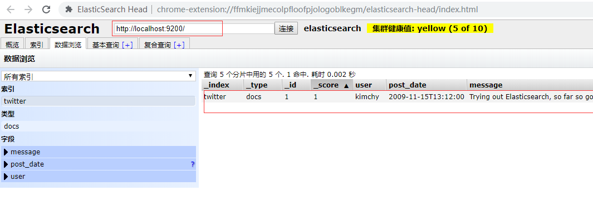
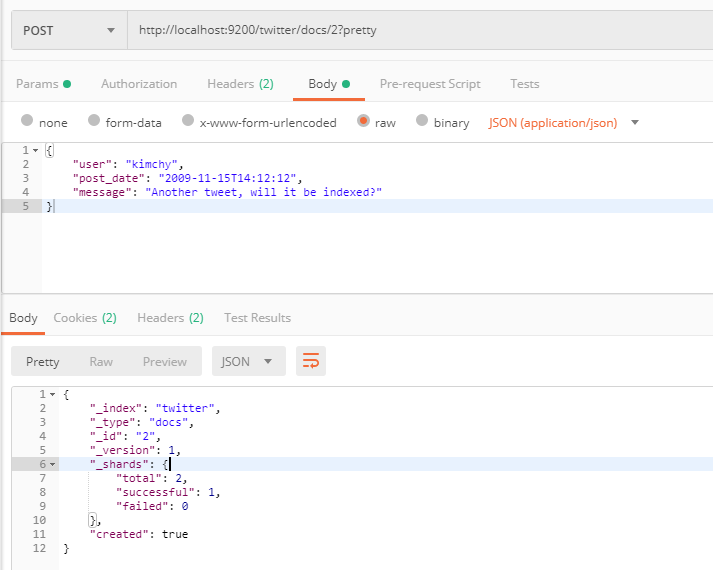
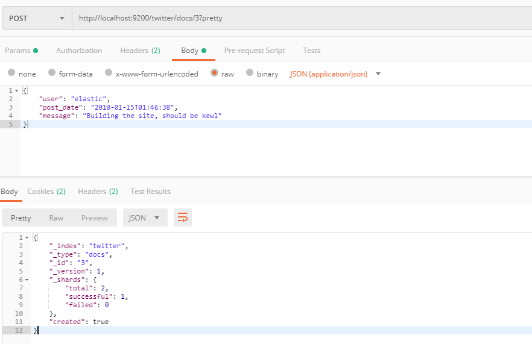
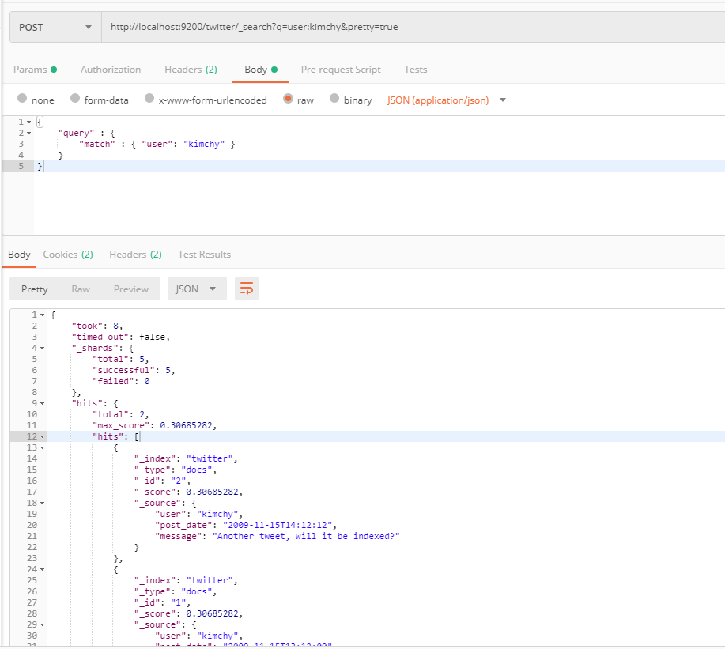
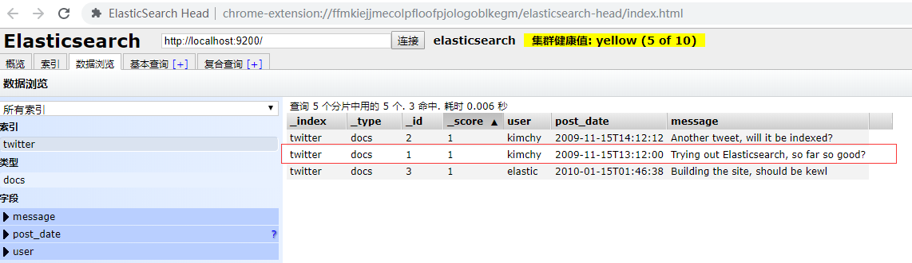

# elasticsearchDemo

elasticsearch learning  -- version 7.4.1.  [github地址](<https://github.com/zhang1github2test/elasticsearchDemo>)

## 一、安装

* 从elasticsearch官网[下载](<https://www.elastic.co/cn/downloads/elasticsearch>)并解压文件

  

* 在window下使用`bin/elasticsearch.bat` 启动，如果是unix系统则使用`bin/ealsticsearch`

  

* 运行 `curl -X GET http://localhost:9200` 查看启动的信息或者直接在浏览器中输入：`localhost:9200` 

## 二、使用入门

> elasticsearch可以支持java原生api以及HTTP RESTful api，使用rest api的接口将使用postman进行操作

1. 创建索引

   `http://localhost:9200/twitter/docs/1?pretty  ` 

   >方法：POST
   >
   >请求体：
   >
   >{
   >    "user": "kimchy",
   >    "post_date": "2009-11-15T13:12:00",
   >    "message": "Trying out Elasticsearch, so far so good?"
   >}
   >
   >```
   >Content-Type: application/json
   >```

   返回值：

   ```json
   {
       "_index": "twitter",
       "_type": "docs",
       "_id": "1",
       "_version": 4,
       "_shards": {
           "total": 2,
           "successful": 1,
           "failed": 0
       },
       "created": true
   }
   ```

   

   通过上面的请求的我们已经成功往`Elasticsearch` 中创建了一个名`twitter` 的索引，同时创建了一个文档类型为`docs` 文件，该文件的id为 `1` 

   使用`Elasticsearch-head` 插件查看创建的数据：

    

   可以看到数据确实已经在ES中进行保存了。

   继续往ES中添加如下的两条数据：

   ```JSON
   {
       "user": "kimchy",
       "post_date": "2009-11-15T14:12:12",
       "message": "Another tweet, will it be indexed?"
   }
   {
       "user": "elastic",
       "post_date": "2010-01-15T01:46:38",
       "message": "Building the site, should be kewl"
   }
   ```

   

   

2. 搜索数据

   * 基于URL上的数据搜索

     ```txt
     http://localhost:9200/twitter/_search?q=user:kimchy&pretty=true
     ```

     返回值如下：

     ```json
     {
         "took": 7,
         "timed_out": false,
         "_shards": {
             "total": 5,
             "successful": 5,
             "failed": 0
         },
         "hits": {
             "total": 2,
             "max_score": 0.30685282,
             "hits": [
                 {
                     "_index": "twitter",
                     "_type": "docs",
                     "_id": "2",
                     "_score": 0.30685282,
                     "_source": {
                         "user": "kimchy",
                         "post_date": "2009-11-15T14:12:12",
                         "message": "Another tweet, will it be indexed?"
                     }
                 },
                 {
                     "_index": "twitter",
                     "_type": "docs",
                     "_id": "1",
                     "_score": 0.30685282,
                     "_source": {
                         "user": "kimchy",
                         "post_date": "2009-11-15T13:12:00",
                         "message": "Trying out Elasticsearch, so far so good?"
                     }
                 }
             ]
         }
     }
     ```

   * 基于请求体的搜索

     ```txt
     http://localhost:9200/twitter/_search?pretty=true
     请求的方法：POTST
     请求体：{
         "query" : {
             "match" : { "user": "kimchy" }
         }
     }
     ```

     

   返回的结果跟上面的相同

   * 范围搜索

     ```txt
     http://localhost:9200/twitter/_search?pretty=true
     请求方法：POST
     请求体：
     {
         "query" : {
             "range" : {
                 "post_date" : { "from" : "2009-11-15T13:00:00", "to" : "2009-11-15T14:00:00" }
             }
         }
     }
     ```

     搜索的结果为：

     ```json
     {
         "took": 10,
         "timed_out": false,
         "_shards": {
             "total": 5,
             "successful": 5,
             "failed": 0
         },
         "hits": {
             "total": 1,
             "max_score": 1,
             "hits": [
                 {
                     "_index": "twitter",
                     "_type": "docs",
                     "_id": "1",
                     "_score": 1,
                     "_source": {
                         "user": "kimchy",
                         "post_date": "2009-11-15T13:12:00",
                         "message": "Trying out Elasticsearch, so far so good?"
                     }
                 }
             ]
         }
     }
     ```

     上述的搜索请求`post_date` 的值在`"2009-11-15T13:00:00", "to" : "2009-11-15T14:00:00" ` 的数据。

     

## 三、ES的配置

es中主要有三种配置文件：

* elasticsearch.yml 用来对ES进行配置
* jvm.options 用来配置ES运行的JVM的配置
* log4j2.properties 用来配置ES的日志配置

1. jvm的选项的配置

   * `#` 开头的将会被当成注解

     ```properties
     #this is a commit
     ```

   * `-` 开头的将会被当成一个JVM的参数

     ```pro
     -Xmx2g
     ```

   * 以数字开头并且紧跟`:` 或`-:`的时候，当数字的值与安装的java版本匹配的时候生效

     ```properties
     8:-Xmx2g
     8-:-Xmx2g
     ```

   * 以数字开头跟着一个`-` ,然后接着一个数字 ，数字后面跟着`:` 。

     ```properties
     8-9:-Xmx2g
     ```

     

