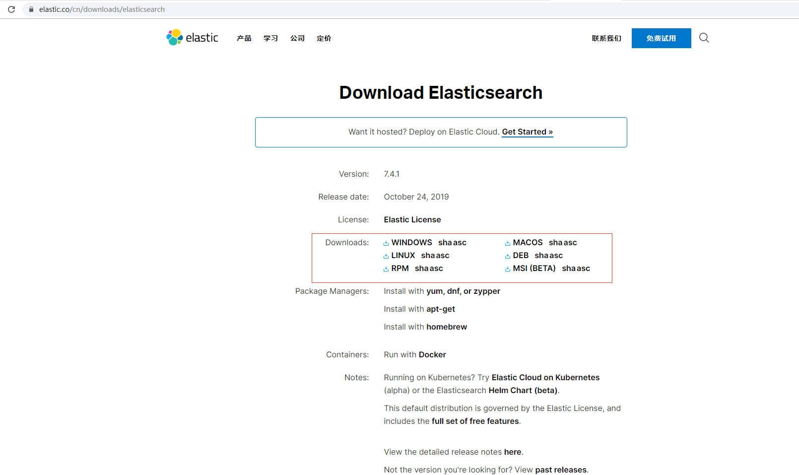
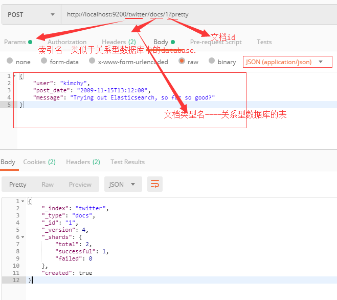

# elasticsearchDemo

elasticsearch learning  -- version 7.4.1.  [github地址](<https://github.com/zhang1github2test/elasticsearchDemo>)

### 一、安装

* 从elasticsearch官网[下载](<https://www.elastic.co/cn/downloads/elasticsearch>)并解压文件

  

* 在window下使用`bin/elasticsearch.bat` 启动，如果是unix系统则使用`bin/ealsticsearch`

  

* 运行 `curl -X GET http://localhost:9200` 查看启动的信息或者直接在浏览器中输入：`localhost:9200` 

## 二、使用入门

> elasticsearch可以支持java原生api以及HTTP RESTful api，使用rest api的接口将使用postman进行操作

1. 创建索引

   `http://localhost:9200/twitter/docs/1?pretty  ` 

   >方法：POST
   >
   >请求体：
   >
   >{
   >    "user": "kimchy",
   >    "post_date": "2009-11-15T13:12:00",
   >    "message": "Trying out Elasticsearch, so far so good?"
   >}
   >
   >```
   >Content-Type: application/json
   >```

   返回值：

   ```json
   {
       "_index": "twitter",
       "_type": "docs",
       "_id": "1",
       "_version": 4,
       "_shards": {
           "total": 2,
           "successful": 1,
           "failed": 0
       },
       "created": true
   }
   ```

   

   通过上面的请求的我们已经成功往`Elasticsearch` 中创建了一个名`twitter` 的索引，同时创建了一个文档类型为`docs` 文件，该文件的id为 `1` 

   使用`Elasticsearch-head` 插件查看创建的数据：

    

2. 搜索数据